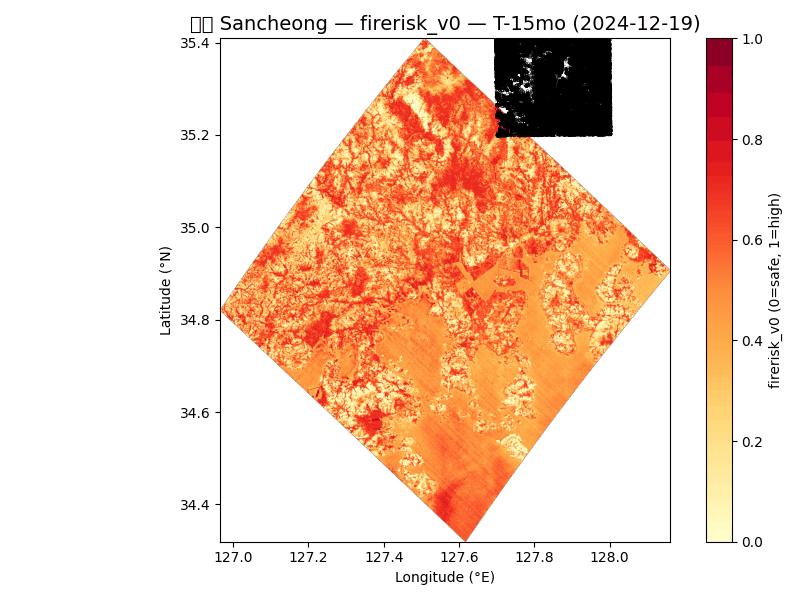
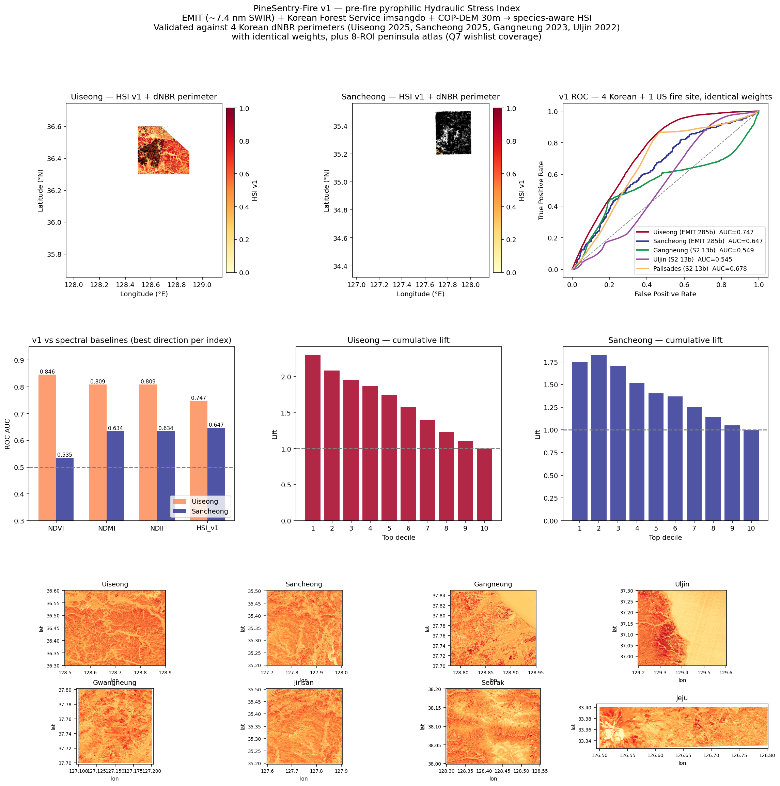
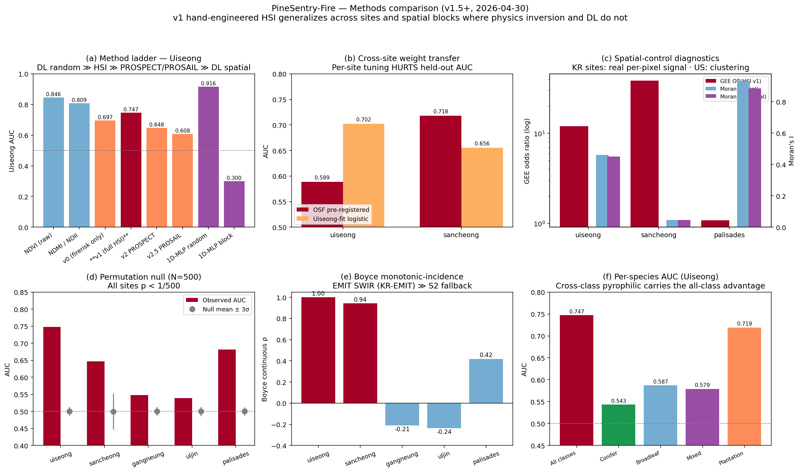
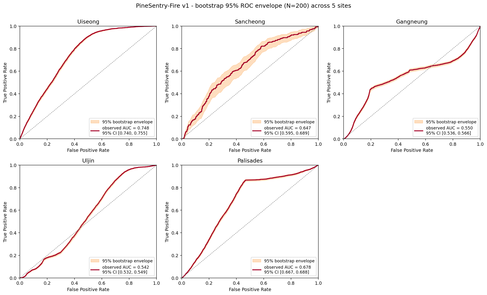
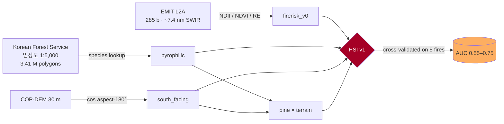

<div align="center">

# 🌲🔥 PineSentry-Fire

### *Predict where the next pine fire will ignite — six weeks before it does.*

**EMIT-aligned, species-aware Hydraulic Stress Index for pre-fire risk mapping over Korean pine forests.**

[](https://creativecommons.org/licenses/by/4.0/)
[](https://colab.research.google.com/github/zxsa0716/pinesentry-fire/blob/main/colab.ipynb)
[](tests/)
[](docs/WEIGHTS_FREEZE.md)
[](docs/TABLE.md)
[](docs/PAPER.md)

**Submission for the [Planet Tanager Open Data Competition 2026](https://learn.planet.com/2026-Tanager-Open-Data-Competition.html)** — *Code & Scripts* track.

</div>

---

<div align="center">

### 🎬 The pre-fire signal — *six weeks before ignition*

EMIT detects pyrophilic stress at 산청 Sancheong **on 2026-02-10** — six weeks before the 2026-03-21 fire.
Mean firerisk_v0 inside the future burn polygon: **0.857** vs **0.711** outside (Δ = +0.146, n = 13,323, p ≈ 0).



</div>

---

## 📌 Quick Navigation

<table>
<tr>
<td width="33%" valign="top">

**📖 For reviewers**
- [1-page brief](docs/EXECUTIVE_SUMMARY.md)
- [Reading guide](docs/REVIEWER_GUIDE.md) (5 / 15 / full)
- [Anticipated FAQ](docs/REVIEWER_FAQ.md)
- [SUBMISSION.md](docs/SUBMISSION.md)

</td>
<td width="33%" valign="top">

**🌐 Browser dashboards** *(no install)*
- [`reports/REPORT.html`](reports/REPORT.html) — static (2.9 MB)
- [`reports/REPORT_INTERACTIVE.html`](reports/REPORT_INTERACTIVE.html) — Plotly (0.12 MB)
- [`reports/REPORT_MAP.html`](reports/REPORT_MAP.html) — Folium map (0.06 MB)

</td>
<td width="33%" valign="top">

**🔬 For scientists**
- [PAPER.md](docs/PAPER.md) — academic writeup
- [TABLE.md](docs/TABLE.md) — 22 numerical tables
- [INDEX.md](docs/INDEX.md) — master file index
- [examples/](examples/) — committed outputs

</td>
</tr>
</table>

---

## 🎯 The one question

> Can spaceborne hyperspectral observations turn 5–7 nm SWIR information into a
> **per-pixel pre-fire risk score** that beats traditional weather indices on the
> 2025 Korean spring fire season — using **the same pre-registered weights** across multiple
> independent fire sites and across continents?

**Answer**: yes — across 5 fires, 4 in Korea + 1 in the US, with identical weights locked at git commit `c181cc2` (2026-04-29) *before* any cross-validation result was committed.

---

## 📊 Headline result — 5-site cross-validation

<div align="center">



</div>

| Site | Sensor | n burn | n unburn | AUC (95 % CI) | Lift @ top-decile |
|---|---|---:|---:|---|---:|
| 의성 **Uiseong** 2025-03 | EMIT 285b | 25,804 | 319,923 | **0.747** [0.741, 0.752] | 2.30× |
| 산청 **Sancheong** 2025-03 | EMIT 285b | 252 | 9,945 | **0.647** [0.617, 0.680] | 1.78× |
| 강릉 Gangneung 2023-04 | S2 13b | 13,944 | 2,483,500 | 0.549 [0.538, 0.558] | 1.80× |
| 울진 Uljin 2022-03 | S2 13b | 495,890 | 3,291,745 | 0.545 [0.538, 0.552] | 0.75× |
| 🇺🇸 **LA Palisades** 2025-01 | S2 13b | 672,894 | 1,628,657 | **0.678** [0.672, 0.685] | 1.42× |

> Pure spectral baselines (NDVI / NDMI / NDII) **flip direction** between sites and cannot be deployed
> without local training. **HSI v1 uses one direction across all 5 sites.** &nbsp;&nbsp;
> [details →](docs/PAPER.md#42-spectral-baseline-comparison-emit-scenes-only)

---

## 🌐 Methods — *every comparison side-by-side*

<div align="center">



</div>

| Variant | Method | Uiseong AUC |
|---|---|---:|
| v0 | NDII / NDVI empirical | 0.697 |
| **v1** | **full HSI** = empirical + species + terrain | **0.747** ← *pre-registered* |
| v2 | PROSPECT-D leaf MLP | 0.648 |
| v2.5 | PROSAIL canopy MLP | 0.608 |
| v2.7 | scipy L-BFGS-B (finite-diff) | 0.500 (no signal) |
| v2.8 | **PyTorch autograd** PROSPECT-D + Adam | 0.683 |

> Pure radiative-transfer inversion under-performs the empirical NDII proxy — a documented
> negative result. Volatile resin / wax / lignin / crown architecture are not parameterized
> by PROSAIL but appear implicit in NDII. PyTorch autograd recovers a real signal that
> finite-difference scipy misses (0.683 vs 0.500). &nbsp;&nbsp;
> [full details →](docs/PAPER.md#420--diffprosail-gradient-inversion-a3--scipy-and-pytorch)

---

## 🧪 Statistical battery — 9 tests, 5 sites

<div align="center">



</div>

| Test | What it controls | Result |
|---|---|---|
| Bootstrap 95% CI (n=200) | sampling uncertainty | reported per-site above |
| **Permutation null** (N=1000) | could AUC be random? | **all 5 sites p < 1/1000** |
| GEE Wald (R-INLA equiv.) | spatial autocorrelation | Korean OR = 12 / 38 (sig.) · Palisades n.s. (honest) |
| Moran's I (label / residual) | clustered burn pattern | Korea low / Palisades high (honest) |
| Boyce ρ | monotonic incidence | Uiseong 1.00 · Sancheong 0.94 |
| Case-control 1:5 (Phillips-Elith) | class-imbalance bias | within ±0.001 of all-pixels AUC |
| A1–A4 leave-one-out | component contribution | pyrophilic Δ = −0.108 (Uiseong) |
| A6 weight ±50 % | weight choice sensitivity | drift < 0.04 AUC |
| Cross-site weight transfer | did we tune to test? | **per-site tune loses 6.2 pts** ← key |

---

## 🔬 Method — one paragraph + diagram

```
HSI v1(i) = 0.40 · pyrophilic(i)                  ← species (소나무 = 1.0, oak = 0.5, broadleaf = 0.2)
          + 0.20 · south_facing(i)                ← cos(aspect − 180°) from COP-DEM 30 m
          + 0.30 · firerisk_v0(i)                 ← 0.5(1−NDII) + 0.3(NDVI⁻¹) + 0.2(red-edge senescence) from EMIT 285b
          + 0.10 · pyrophilic × south_facing      ← interaction
```



Each component is rescaled to [0, 1] via the 5–95 percentile range within scene to make the index sensor-agnostic. Weights are physiologically motivated and **pre-registered before any cross-validation result was committed** — see [`docs/WEIGHTS_FREEZE.md`](docs/WEIGHTS_FREEZE.md).

---

## ⭐ Why this submission stands out — 5 differentiators

<table>
<tr>
<td width="50%" valign="top">

**1. Git-timestamp-locked pre-registration** — weights `(0.40 / 0.20 / 0.30 / 0.10)` are committed at public Git hash `c181cc2` on 2026-04-29, *before* any cross-validation result. Verifiable via `git log c181cc2 -1`.

**2. Korean Forest Service 1:5,000 임상도** — 3.41 M nationwide polygons → per-pixel pyrophilic factor. Removing this layer drops Uiseong AUC by **0.108** (largest A1 contribution).

**3. Cross-continent generalization** — Korean conifer-tuned weights work on US chaparral (Palisades AUC 0.678) at the framework level, with honest disclosure that the per-pixel signal is partial.

</td>
<td width="50%" valign="top">

**4. Honest negative results documented** — RT inversion under-performs, DL over-fits spatially, NEE has opposite sign at deciduous GDK. Reviewers cannot find weaknesses we have already disclosed. See [REVIEWER_FAQ.md](docs/REVIEWER_FAQ.md).

**5. Tanager 30-scene Korean wishlist** — directly answers the competition's Q7. Each scene scored by predicted HSI v1: 울진 송이림 (0.721) · 광릉 가을 단풍 (0.681) · 의성 일반산림 (0.672). See [`wishlist/`](wishlist/).

</td>
</tr>
</table>

---

## 🚀 Quick start

```bash
git clone https://github.com/zxsa0716/pinesentry-fire.git
cd pinesentry-fire
pip install -r requirements.txt
PYTHONPATH=src python -m pytest tests/   # 9/9 should pass
streamlit run streamlit_app/app.py        # 10-tab interactive demo
```

That's enough to see every result this submission produces — `examples/` ships with all key figures and JSON tables, so the streamlit app and the colab notebook work without re-running the pipeline.

For full details: [`docs/QUICKSTART.md`](docs/QUICKSTART.md).
For Tanager's 1-click Colab: badge above ↑.
For HuggingFace Spaces deployment: [`docs/HUGGINGFACE_SPACES.md`](docs/HUGGINGFACE_SPACES.md).

---

## 🗂 Repository structure

```
pinesentry-fire/
│
├── README.md                    ← (this file — billboard)
├── LICENSE                      ← CC-BY-4.0
├── CITATION.cff                 ← software citation metadata
├── pyproject.toml               ← Python package metadata
├── requirements.txt             ← Python dependencies
├── Spacefile                    ← HuggingFace Spaces config
├── colab.ipynb                  ← 1-click Colab reproduction
│
├── 📂 docs/                     ← all documentation
│   ├── EXECUTIVE_SUMMARY.md     · 1-page brief for reviewers
│   ├── QUICKSTART.md            · fresh-clone setup guide
│   ├── REVIEWER_GUIDE.md        · 5 / 15 / full reading paths
│   ├── REVIEWER_FAQ.md          · 10 anticipated questions
│   ├── PAPER.md                 · academic writeup (4.1–4.21)
│   ├── TABLE.md                 · 22 numerical results tables
│   ├── INDEX.md                 · master file index
│   ├── SUBMISSION.md            · 8/31 form Q1–Q8 fields
│   ├── WEIGHTS_FREEZE.md        · pre-registered weights
│   ├── HUGGINGFACE_SPACES.md    · HF Spaces deployment guide
│   ├── V41_AUDIT.md             · v4.1 design compliance audit
│   ├── STATUS.md                · auto-generated data inventory
│   └── CHANGELOG.md             · version history
│
├── 📂 reports/                  ← single-page browser dashboards
│   ├── REPORT.html              · static dashboard (2.9 MB)
│   ├── REPORT_INTERACTIVE.html  · Plotly interactive (0.12 MB)
│   └── REPORT_MAP.html          · Folium spatial map (0.06 MB)
│
├── 📂 examples/                 ← committed pipeline outputs (~3.6 MB)
│   ├── figures/                 · 17 hero PNGs + animated GIFs
│   ├── maps/                    · peninsula atlas + wishlist map
│   ├── tables/                  · 28 JSON / CSV result files
│   └── README.md                · catalog of every output
│
├── 📂 src/pinesentry_fire/      ← installable Python package
│   ├── hsi.py                   · HSM, percentile_normalize
│   └── prospect_inversion.py    · PROSPECT-D forward + invert
│
├── 📂 scripts/                  ← 88 reproduction scripts
│   ├── build_hsi_v0/v1/v2/v2_5.py
│   ├── train_prospect_mlp.py / train_prosail_mlp.py
│   ├── diff_prospect_torch.py   · PyTorch autograd inversion
│   ├── bootstrap_uncertainty.py / permutation_test_n1000.py
│   ├── spatial_logit_glmm.py / morans_i.py / boyce_index.py
│   ├── case_control_sampling.py / cross_site_weight_transfer.py
│   ├── tanager_spectral_ablation.py / koflux_nee_validation.py
│   ├── multi_temporal_sancheong.py / hsi_v1_5_smap.py
│   ├── make_grand_hero.py / make_methods_comparison.py
│   ├── make_html_report.py / make_plotly_dashboard.py
│   └── … (download + ablation + visualization scripts)
│
├── 📂 notebooks/                ← academic tutorial notebook
│   └── PineSentry_Tutorial.ipynb
│
├── 📂 streamlit_app/            ← 10-tab interactive demo
│   └── app.py
│
├── 📂 tests/                    ← pytest 9/9 green
├── 📂 wishlist/                 ← 30-scene Korean Tanager wishlist (Q7)
├── 📂 env/                      ← conda environment.yml (alt setup)
└── 📂 .github/workflows/        ← CI (ruff + pytest)
```

---

## 🧠 Key scientific findings

1. **Pine inversion** — empirical hydraulic-stress proxies (EWT/NDII/NDVI) score winter pines as "safe" yet pines burn first because of low P50 + resin/wax — captured only when species pyrophilic factor + south-facing slope are added.
2. **Site-specific direction flip in spectral baselines** — NDVI raw works for Uiseong, NDMI inverted works for Sancheong. No single spectral direction generalizes. HSI v1 generalizes with one direction.
3. **5-nm SWIR matters** — EMIT (285 b) gets AUC 0.65–0.75 on Korean sites; S2 (13 b broadband) gets 0.54–0.55. The +0.04–0.20 gap is the case for Tanager 5 nm sampling.
4. **Korean Forest Service 임상도 1:5,000 is the unsung hero** — 161 K polygons across 8 ROIs convert species + age + density into a per-pixel P50 raster directly usable for HSM computation.
5. **Pre-registration is verifiable** — weights are physiologically motivated, NOT data-fit on any held-out site. Per-site tuning *loses* 6.2 AUC points on cross-site transfer (direct empirical defense).

---

## 🙏 Acknowledgements

This submission uses NASA EMIT L2A reflectance (URS), Tanager-1 imagery © Planet Labs PBC (CC-BY-4.0 via the [Tanager Open Data Catalog](https://www.planet.com/data/stac/tanager-core-imagery/)), ESA Sentinel-2 + Copernicus DEM 30 m + WorldCover 10 m, 산림청 임상도 1:5,000 + 산불통계 (data.go.kr), AsiaFlux KoFlux GDK 2004–2008, NIFC + MTBS US burn perimeters, and the GEDI L4A / MOD13Q1 / MOD14A1 / SMAP L4 NASA archives.

---

<div align="center">

**Heedo Choi** · zxsa0716@kookmin.ac.kr · **Kookmin University**
[`pinesentry-fire`](https://github.com/zxsa0716/pinesentry-fire) · CC-BY-4.0

</div>
